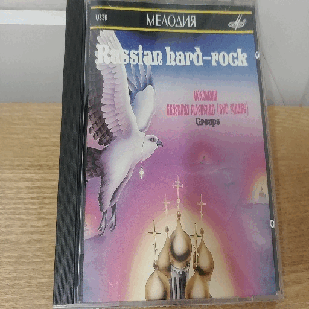

# Light-OCR-API

이 저장소는 경량화 한글 문자 탐지 및 인식 API 공개 저장소입니다.

## 0. API 사용법

> 사진 한 장에 대한 OCR 결과는 다음을 실행하여 얻을 수 있습니다.

  ```bash
  $ curl --request POST http://27.255.77.102:5000/evaluation --form 'file=@[소스 이미지]'
  
  ex)
  $ curl --request POST http://27.255.77.102:5000/evaluation --form 'file=@sample_image.jpg'
  ```


## 1. Evaluation

> AI-Hub 데이터에 대한 모델 성능 테스트는 다음을 통해 가능합니다.

### 1.0 Data preprocessing

> evaluation 에 사용할 각 API의 JSON파일은 [dataset-repo](https://github.com/jentiai/Korean-Light-OCR-Data) 에서 다음을 실행하여 생성할 수 있습니다.

```
python kakao.py [path/to/image] [appkey]

python naver.py [path/to/image] [api_url] [api_key]
 
python jenti.py [path/to/image]
```

> * 생성된 JSON 파일의 이름은 **naver.json**, **kakao.json**, **jenti.json** 입니다.
>
> * 또한 추가적으로  [dataset-repo](https://github.com/jentiai/Korean-Light-OCR-Data) 어서 **gt.txt** 도 생성해야 합니다. 자세한 설명은  [dataset-repo](https://github.com/jentiai/Korean-Light-OCR-Data)를 참고해주세요.

### 1.1 Evaluation

```
python api_eval_v1.py --api_res_json [1.0 에서 생성한 .json 파일] --txt_gt_dir [1.0에서 생성한 gt 디렉토리]
```


## 2. Model Result

> API를 이용하여 얻은 OCR를 원본 사진에 표현하는 방법은 다음과 같습니다. 

  ```bash
  $ python show_result.py --img_dir [이미지 directory] --output_dir [visualize할 이미지가 저장될 위치]

ex) $ python show_result.py --img_dir ./sample/ --output_dir ./output/
  ```




## 3. 한글 경량화 OCR 모델 구조
> 본 한글 경량화 OCR 모델은 Detector (텍스트 탐지) 와  Recognizer (텍스트 인식) 으로 구분됩니다. 아래는 각 모듈에 대한 요약입니다. 

### (1) Detector
<center>
    
</center>

- **텍스트 탐지 모듈 요약**


| Backbone | IoU Threshold / confidence | 파라미터 수 | size(MB) | Recall  | Precision | F1 |
| :---: | :---: | :---: | :---: | :---: | ----- | :---: |
| MobileNetV3 | 0.3 / 0.7 | 1,846,312 | 7.39 | 0.7233 | 0.8323 | 0.7739 |
| MobileNetV3 | 0.45 / 0.7 | 1,846,312 | 7.39 | 0.7617 | 0.8045 | **0.7825** |
| MobileNetV3 | 0.55 / 0.75 | 1,846,312 | 7.39 | 0.7553 | 0.8106 | 0.7820 |

* 텍스트 탐지에는 Differentiable Binarization [2] 의 Backbone을 MobileNetV3로 교체한 모델을 사용했습니다.
* 기존 ResNet-18 또는 ResNet-50을 MobileNetV3으로 대체하여 파라미터 수와 모델 size를 대폭 감소시켰습니다.


### (2) Recognizer
<center>
    
</center>

- **텍스트 인식 모듈 요약**


| Model | FeatureExtraction | SequenceModel | Prediction | 파라미터 수 | size (MB) | 정확도 (%)|
| :---: | :---: | :---: |:---: | :---: | :---: | :---: |
| BASE (H) | MobileNetV3 (576) | BiLSTM (48) | CTC | 1,216,100 | 4.86 | 88.524 |
| **BEST** (H) | MobileNetV3 (576) | BiLSTM (48) | Attention | 1,246,532 | 4.99 | **90.709** |
| BASE (V) | MobileNetV3 (576) | BiLSTM (48) | CTC | 1,216,100 | 4.86 | 87.234 |
| **BEST** (V) | MobileNetV3 (576) | BiLSTM (48) | Attention | 1,246,532 | 4.99 | **89.821** |

* 텍스트 인식 모듈은 TPS를 사용하지 않았습니다.
* MobileNetV3와 BiLSTM의 경우 각각 차원을 576, 48로 사용하여 기존보다 파라미터 수를 대폭 감소시켰습니다.
* 모델의 입력은 가로와 세로의 길이가 각각 192, 48인 RGB 이미지 입니다.
* 한글, 영어와 특수 문자 일부를 약 1200개의 음절을 인식 모듈에 사용했습니다.
* 한글의 경우 가로 글씨 (H) 와 세로 글씨 (V) 각각의 인식률을 높이기 위해 구조가 동일한 두 개의 모델을 따로 훈련하였습니다.
* CTC 추론 모듈 대신 Attention(default) 추론 모듈 사용시, 모델의 size는 0.13 (MB) 증가한 반면, 인식률이 약 2% 증가합니다.
* ``TPS-ResNet50(512)-BiLSTM(256)-Attention``을 이용한 모델 [3]과 비교했을 때, 텍스트 인식률을 유지하면서 모델의 사이즈는 약 38배 감소하였습니다.

## 4. 참고 자료

[1] Character Region Awareness for Text Detection.
   Youngmin Baek, Bado Lee, Dongyoon Han, Sangdoo Yun, and Hwalsuk Lee.
  Proceedings of the IEEE/CVF Conference on Computer Vision and Pattern Recognition.
  9365-9374. 2019.

[2] Minghui Liao, Zhaoyi Wan, Cong Yao, Kai Chen,  and Xiang Bai. Real-Time Scene Text Detection with Differentiable Binarization.
  Proceedings of the AAAI Conference on Artificial Intelligence. 34. 7. 11474--11481. 2020.

[3] Jeonghun Baek, Geewook Kim, Junyeop Lee, Sungrae Park, and Dongyoon Han, Sangdoo Yun, Seong Joon Oh, and Hwalsuk Lee. What is Wrong with Scene Text Recognition Model Comparisons? Dataset and Model Analysis. Proceedings of the IEEE/CVF International Conference on Computer Vision. 4715-4723. 2019.

[4] PP-OCR: A practical Ultra Lightweight OCR System.
  Yuning Du, Chenxia Li, Ruoyu Guo, Xiaoting Yin, Weiwei Liu, Jun Zhou, Yifan Bai, Zilin Yu, Yehua Yang, Qingqing Dang, et. al. arXiv preprint arXiv:2009.09941. 2020.