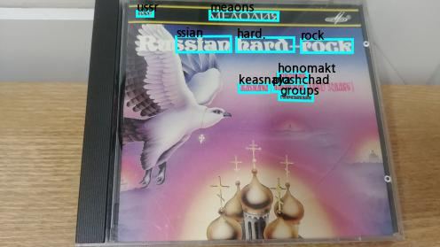
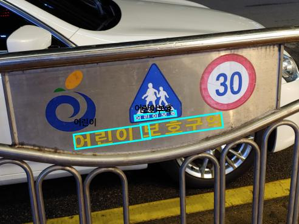
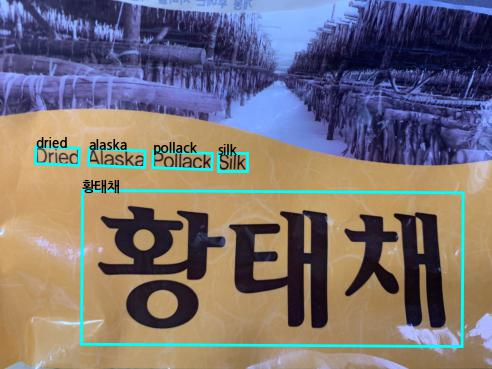

# Light-OCR-API

이 저장소는 경량화 한글 문자 탐지 및 인식 공개 API를 설명하기 위한 저장소입니다.

## 1. API 사용법

  ```bash
  $ curl --request POST http://27.255.77.102:5000/evaluation --form 'file=@[이미지경로]'
  
  ex)
  $ curl --request POST http://27.255.77.102:5000/evaluation --form 'file=@sample_image.jpg'
  ```


## 2. Model Result

API를 이용하여 얻은 OCR를 원본 이미지에서 표현하는 방법은 다음과 같습니다. 

  ```bash
  $ python model_result.py --img_dir [이미지가 담겨있는 directory] --output_dir [OCR 결과를 이용하여 visualize한 이미지들의 output directory]

ex)
  $ python model_result.py --img_dir ./sample/ --output_dir ./output/
  ```

<center>
    <p float="left">
        
        
        
    </p>
</center>

## 3. 한글 경량화 OCR 모델 구조
저희 한글 경량화 OCR 모델은 Detector (텍스트 탐지) 와  Recognizer (텍스트 인식) 으로 구분됩니다. 아래는 각 모듈에 대한 요약입니다. 

### (1) Detector
- 텍스트 탐지 모듈 그림

<center>
    
</center>

- 텍스트 탐지 모듈 요약
<center>

| Backbone | Train Dataset | Threshold/ Box threshold | 파라미터 수 | size(MB) | Recall  | Precision | F1 |
| :---: | :---: |:---: | :---: | :---: | :---: | ----- | ----- |
| MobileNetV3 | AIHUB | 0.3 / 0.7 | 1,846,312 | 7.39 | 0.7233 | 0.8323 | 0.7739 |
| MobileNetV3 | AIHUB | 0.45 / 0.7 | 1,846,312 | 7.39 | 0.7617 | 0.8045 | **0.7825** |
| MobileNetV3 | AIHUB | 0.55 / 0.75 | 1,846,312 | 7.39 | 0.7553 | 0.8106 | 0.7820 |

</center>

* 텍스트 탐지 모듈은 Differentiable Binarization 모델의 Backbone을 MobileNetV3로 교체한 모델입니다.
* 기존 ResNet-18 과 ResNet-50을 MobileNetV3으로 대체함으로써 파라미터 수와 모델 size를 대폭 감소 시킬 수 있었습니다.


### (2) Recognizer
- 텍스트 인식 모듈 그림
    
<center>
    
</center>
    
- 텍스트 인식 모듈 요약
<center>

| Model | FeatureExtraction | SequenceModel | Prediction | 파라미터 수 | size (MB) | 정확도 (%)|
| :---: | :---: | :---: |:---: | :---: | :---: | :---: |
| BASE (H) | MobileNetV3 (576) | BiLSTM (48) | CTC | 1,216,100 | 4.86 | 88.524 |
| **BEST** (H) | MobileNetV3 (576) | BiLSTM (48) | Attention | 1,246,532 | 4.99 | **90.709** |
| BASE (V) | MobileNetV3 (576) | BiLSTM (48) | CTC | 1,216,100 | 4.86 | 87.234 |
| **BEST** (V) | MobileNetV3 (576) | BiLSTM (48) | Attention | 1,246,532 | 4.99 | **89.821** |

</center>

* 텍스트 인식 모듈은 TPS를 사용하지 않았습니다.
* MobileNetV3와 BiLSTM의 경우 각각 차원을 576, 48로 사용하여 기존보다 파라미터 수가 대폭 감소되었습니다.
* 모델의 입력은 가로와 세로의 길이가 각각 192, 48인 RGB 이미지입니다.
* 사용한 음소는 한글, 영어와 특수 문자 일부를 사용한 약 1200개를 사용했습니다.
* 한글의 경우 가로 글씨 (H) 와 세로 글씨 (V) 각각의 인식률을 높이기 위해 구조가 동일한 두 개의 모델을 따로 훈련하였습니다.
* CTC 대신 Attention(기본값)으로 추론 시 모델의 size는 0.13 (MB) 증가한 반면, 인식률이 약 2% 증가합니다.
* ``TPS-ResNet50-BiLSTM-Attention``을 이용한 모델 대비, 텍스트 인식률을 거의 유지하면서, 모델의 사이즈는 약 38배 감소되었습니다.

## 4. 참고 자료

[1] @inproceedings{baek2019character,
  title={Character region awareness for text detection},
  author={Baek, Youngmin and Lee, Bado and Han, Dongyoon and Yun, Sangdoo and Lee, Hwalsuk},
  booktitle={Proceedings of the IEEE/CVF Conference on Computer Vision and Pattern Recognition},
  pages={9365--9374},
  year={2019}
}

[2] @inproceedings{liao2020real,
  title={Real-time scene text detection with differentiable binarization},
  author={Liao, Minghui and Wan, Zhaoyi and Yao, Cong and Chen, Kai and Bai, Xiang},
  booktitle={Proceedings of the AAAI Conference on Artificial Intelligence},
  volume={34},
  number={07},
  pages={11474--11481},
  year={2020}
}

[3] @inproceedings{baek2019wrong,
  title={What is wrong with scene text recognition model comparisons? dataset and model analysis},
  author={Baek, Jeonghun and Kim, Geewook and Lee, Junyeop and Park, Sungrae and Han, Dongyoon and Yun, Sangdoo and Oh, Seong Joon and Lee, Hwalsuk},
  booktitle={Proceedings of the IEEE/CVF International Conference on Computer Vision},
  pages={4715--4723},
  year={2019}
}

[4] @article{du2020pp,
  title={PP-OCR: A practical ultra lightweight OCR system},
  author={Du, Yuning and Li, Chenxia and Guo, Ruoyu and Yin, Xiaoting and Liu, Weiwei and Zhou, Jun and Bai, Yifan and Yu, Zilin and Yang, Yehua and Dang, Qingqing and others},
  journal={arXiv preprint arXiv:2009.09941},
  year={2020}
}
